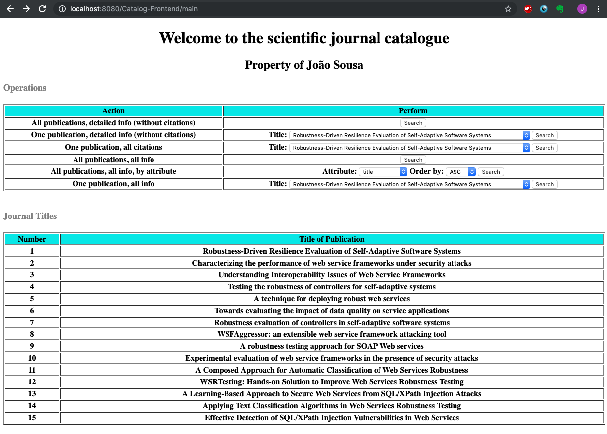

# javaEEapplication
A first simple Java EE application that makes use of concepts such as JPA, EJB, Web services and EAR integrating every component into a small web application 

### App screenshot

